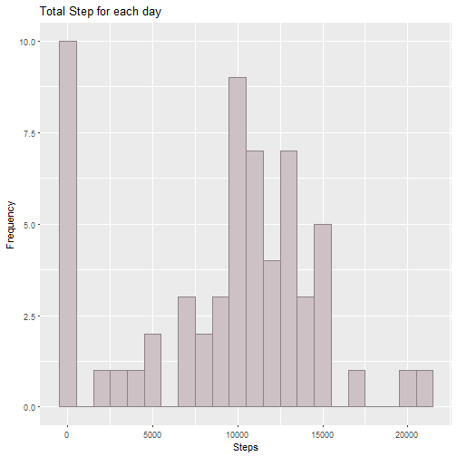
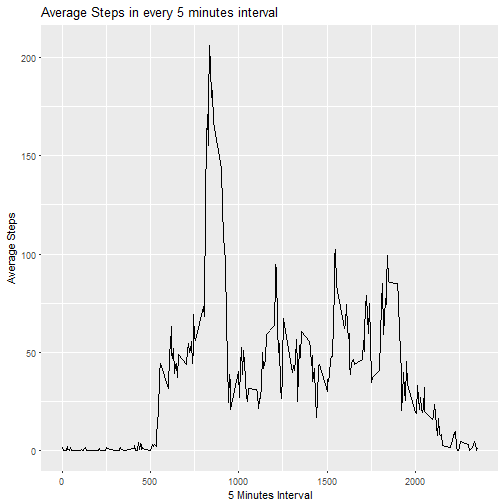
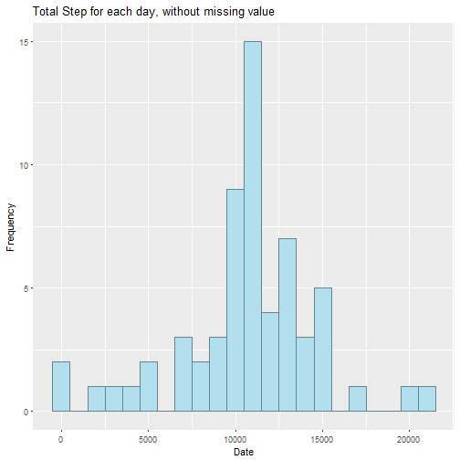
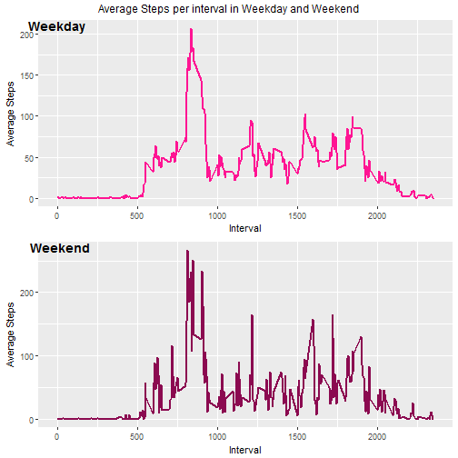

Final Asignment for Reproducible Research
==========================================

### Loading and proprocessing the data
#### Load the data

```r
data_set <- read.csv('activity.csv')
```

### What is mean total number of steps taken per day
##### *Missing value and be ignored here*
#### 1. Calculate the total number of steps taken per day

```r
result <- aggregate(x = list(Total = data_set$steps), by = list(date = data_set$date), FUN = sum, na.rm = TRUE)
head(result, 10)
```

```
##          date Total
## 1  2012-10-01     0
## 2  2012-10-02   126
## 3  2012-10-03 11352
## 4  2012-10-04 12116
## 5  2012-10-05 13294
## 6  2012-10-06 15420
## 7  2012-10-07 11015
## 8  2012-10-08     0
## 9  2012-10-09 12811
## 10 2012-10-10  9900
```

#### 2. Make a histogram of the total number of steps taken each day

```r
library(ggplot2)
plot <- ggplot(result, aes(x = Total)) +
    geom_histogram(fill = 'lavenderblush3', color = 'lavenderblush4', binwidth = 1000) +
    labs(title = 'Total Step for each day') +
    labs(x = 'Steps', y = 'Frequency')
plot
```



#### 3. Calculate and report the mean and median of the total number of steps taken per day
Mean:

```r
mean(result$Total, na.rm = TRUE)
```

```
## [1] 9354.23
```

Median:

```r
median(result$Total, na.rm = TRUE)
```

```
## [1] 10395
```

###What is the average daily activity pattern?
#### 1. Make a time series plot (i.e. \color{red}{\verb|type = "l"|}type="l") of the 5-minute interval (x-axis) and the average number of steps taken, averaged across all days (y-axis)

```r
mean_interval <- aggregate(x = list(avg_step = data_set$steps), by = list(interval = data_set$interval), FUN = mean, na.rm = TRUE)
ggplot(mean_interval, aes(x = interval, y = avg_step)) + geom_line() +
    labs(x = '5 Minutes Interval', y = 'Average Steps') + 
    labs(title = 'Average Steps in every 5 minutes interval')
```



#### 2. Which 5-minute interval, on average across all the days in the dataset, contains the maximum number of steps?
When is the maximum average steps:

```r
mean_interval[which.max(mean_interval$avg_step), ]$interval
```

```
## [1] 835
```

### Imputing missing values
#### 1. Calculate and report the total number of missing values in the dataset(i.e the total number of rows with NAs)

```r
sum(is.na(data_set$steps))
```

```
## [1] 2304
```
#### 2. Devise a strategy for filling in all of the missing values in the dataset. The strategy does not need to be sophisticated. For example, you could use the mean/median for that day, or the mean for that 5-minute interval, etc.
Filling Missing Values Strategy: Take average 5-minutes interval

```r
for(i in 1:nrow(data_set)) {
    if (is.na(data_set[i, 'steps'])){
        corr_interval <- data_set[i, 'interval']
        data_set[i, 'steps'] <- mean_interval[mean_interval$interval == corr_interval, 2]
    }
}
```
#### 3. Create a new dataset that is equal to the original dataset but with the missing data filled in.

```r
library(data.table)
```

```
## Warning: package 'data.table' was built under R version 3.5.1
```

```
## data.table 1.11.4  Latest news: http://r-datatable.com
```

```r
data_set_no_na <- copy(data_set)
```
#### 4. Make a histogram of the total number of steps taken each day and Calculate and report the mean and median total number of steps taken per day. Do these values differ from the estimates from the first part of the assignment? What is the impact of imputing missing data on the estimates of the total daily number of steps?

```r
sum_per_day_no_na <- aggregate(x = list(total_step = data_set_no_na$steps), by = list(date = data_set_no_na$date), FUN = sum)
 ggplot(sum_per_day_no_na, aes(x = total_step)) +
    geom_histogram(fill = 'lightblue2', color = 'lightblue4', binwidth = 1000) +
    labs(title = 'Total Step for each day, without missing value') +
    labs(x = 'Date', y = 'Frequency')
```



Mean 

```r
mean(sum_per_day_no_na$total_step)
```

```
## [1] 10766.19
```

Median 

```r
median(sum_per_day_no_na$total_step)
```

```
## [1] 10766.19
```

The mean and median have slightly increased.

### Are there differences in activity patterns between weekdays and weekends?
#### 1. Create a new factor variable in the dataset with two levels – “weekday” and “weekend” indicating whether a given date is a weekday or weekend day.


```r
data_set_no_na$date <- as.Date(data_set_no_na$date, '%Y-%m-%d')
for (i in 1:nrow(data_set_no_na)) {
    if(weekdays(data_set_no_na[i, 'date']) == 'lördag'| weekdays(data_set_no_na[i, 'date']) =='söndag' ){
        data_set_no_na[i, 4] <- 'weekend'
    }
    else{
        data_set_no_na[i, 4] <- 'weekday'
    }
}
colnames(data_set_no_na)[4] <- 'week_end_day'
```

#### 2. Make a panel plot containing a time series plot (i.e. type="l") of the 5-minute interval (x-axis) and the average number of steps taken, averaged across all weekday days or weekend days (y-axis). 

```r
library(ggpubr)
```

```
## Warning: package 'ggpubr' was built under R version 3.5.1
```

```
## Loading required package: magrittr
```

```r
week <- split(data_set_no_na, data_set_no_na$week_end_day)
weekday <- week$weekday
weekend <- week$weekend
weekday_avg_per_int <- aggregate(x = list(avg_step = weekday$steps), by = list(interval = weekday$interval), FUN = mean)
weekend_avg_per_int <- aggregate(x = list(avg_step = weekend$steps), by = list(interval = weekend$interval), FUN = mean)
```

```
## Error in aggregate.data.frame(as.data.frame(x), ...): no rows to aggregate
```

```r
plot_wkday <- ggplot(weekday_avg_per_int, aes(x = interval, y = avg_step)) +
    geom_line(color = 'deeppink', size = 0.8) +
    labs(x = 'Interval', y = 'Average Steps')
plot_wkend <- ggplot(weekend_avg_per_int, aes(x = interval, y = avg_step)) +
    geom_line(color = 'deeppink4', size = 0.8) +
    labs(x = 'Interval', y = 'Average Steps')
final_plot <- ggarrange(plot_wkday, plot_wkend, labels = c("Weekday", "Weekend"), nrow = 2)
annotate_figure(final_plot, 
                top = text_grob('Average Steps per interval in Weekday and Weekend'))
```


